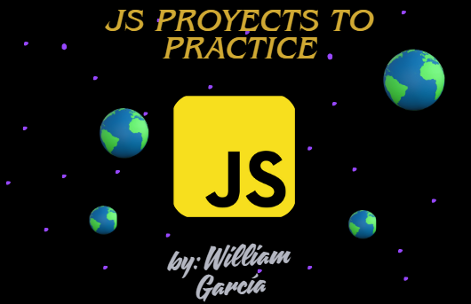

    

<h2 align="center">Learning JS 🍷</h2>

Learning JS with colorful projects!

--- 

# List of all js projects 🧷
| N° | Project name | Code |
| --- | --- | --- |
| `01` | 01-todo-list | [See](projects/01-todo-list/) |
| `02` | 02-dinamic-dashboard | [See](projects/02-dinamic-dashboard/) |