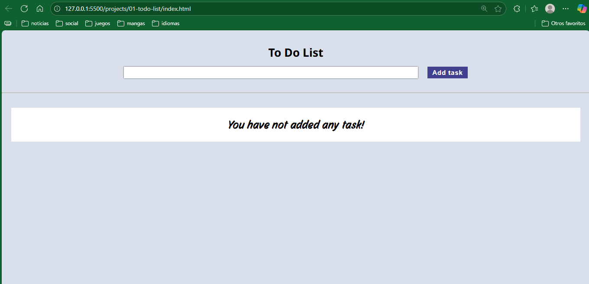
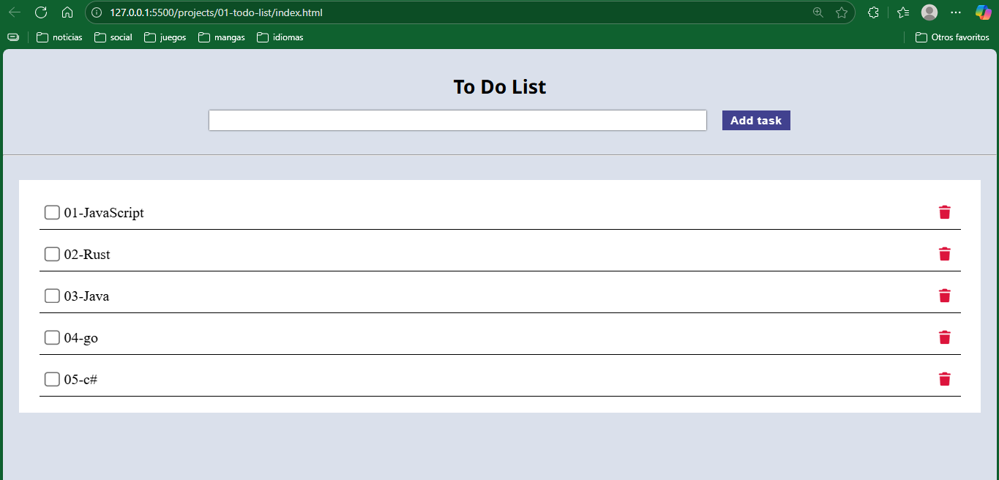

# Project 1: todo-list ✅

## Topics you will learn / practice
- localStorage
- querySelector (to select elements by id or class)
- functions 
- events
- events delegation

--- 

## Previews

    
     
     
    

