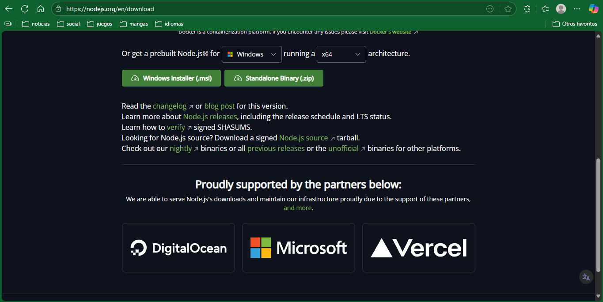
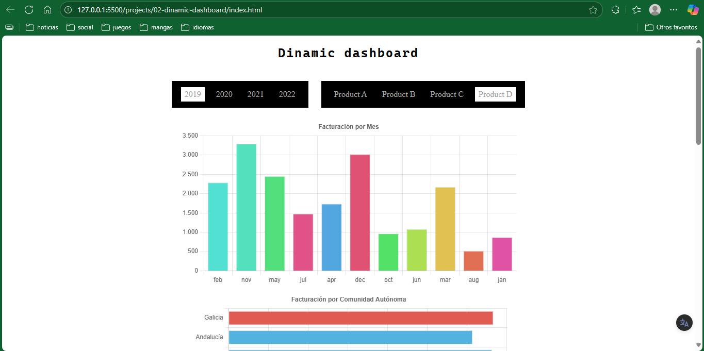

# Project 2: Dinamic dashboard 📊

## Topics you will learn / practice
- chart.js library
- manipulate data from a JSON
- destructuring of objects
- querySelector (to select elements by id or class)
- functions 
- events
- events delegation
- ajax + fetch with asynchrony
- forEach, map and filter methods
- set (similar to an array but without duplicates)
- sort method to sort arrays
- manage template tags

--- 

# Notice
- To use `chart.js` library (in this case) you need to install it by pnpm (you can also use npm, but pnpm is faster and more secure). If you don't have installed `npm` or `
pnpm`, you must download and install nodejs



- After installing nodejs, by default you'll have `npm`. To install `pnpm`, use this command (`cmd`)

```
npm install -g pnpm 
```

- To use this project, you need to execute this command: 
```
pnpm add
```

---

## Previews

<p align="center">
    
    <br>
    <br>
</p>